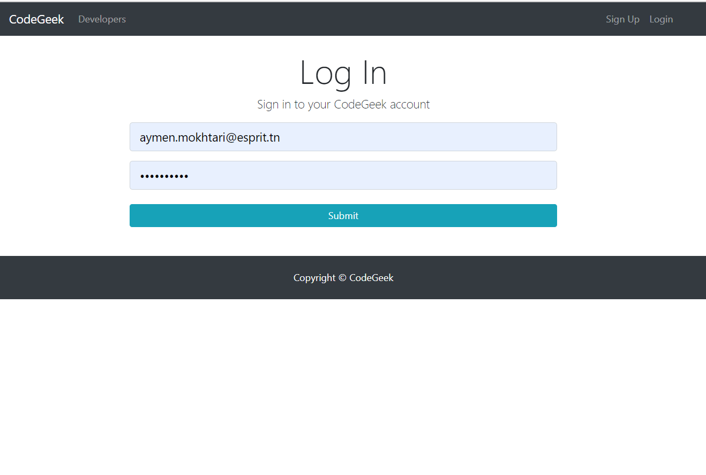
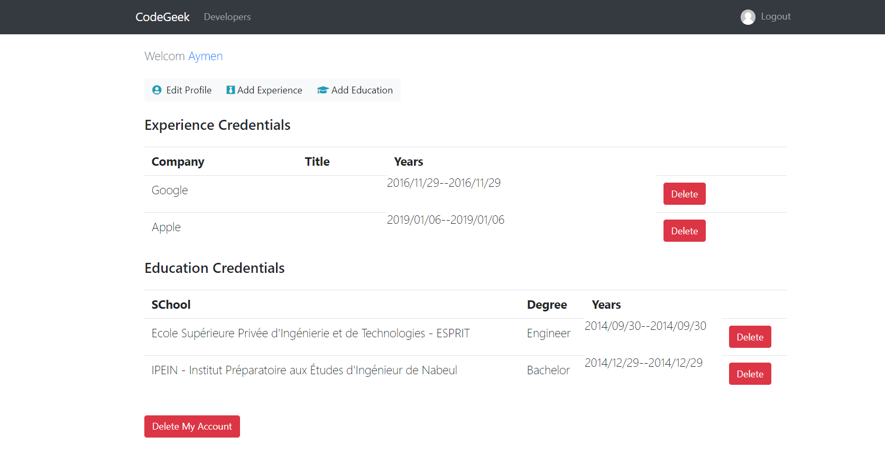
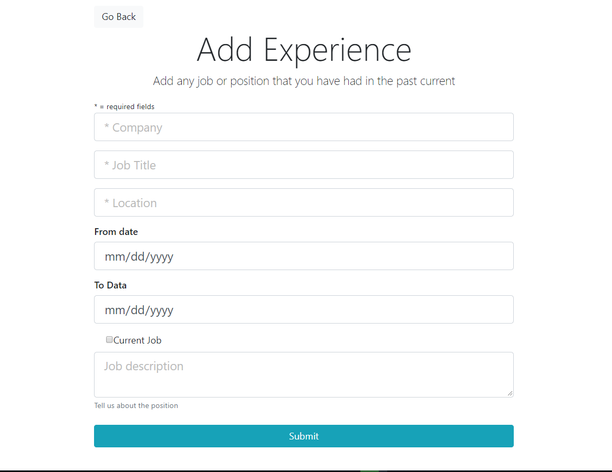
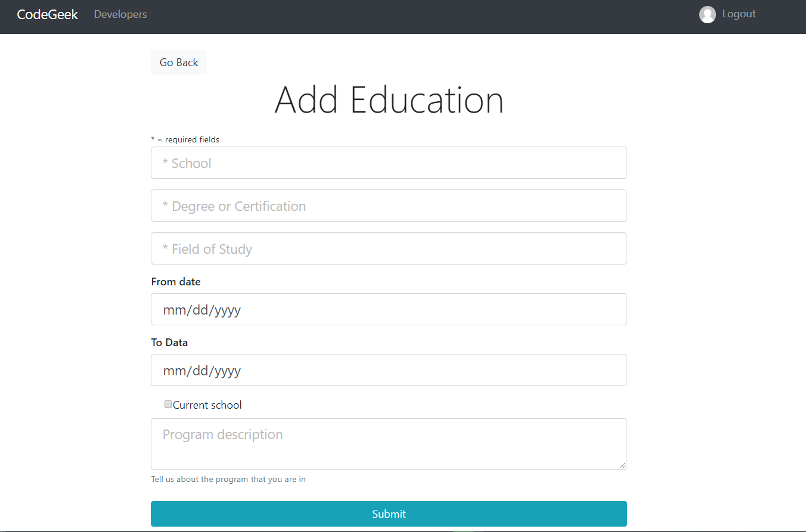
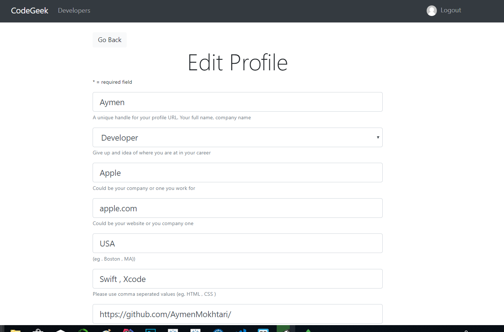

# MERN_Stack_social_network-React-Express-Node-Mongo

A social network to connect developers, built with React+Redux , Node.js, Express, and MongoDB.

● Developed a secure user authentication process through the use of BCrypt and password hashing.

● Effectively managed redux state by making axios calls on mount of components while handling all user auth and exceptions as part of the global state

  
  
  
  
  

